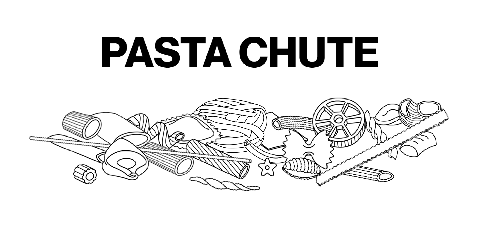

- Concept of your project. Where does your idea come from? What is you communication aim? What is the context of use of your project? What devices are part of the experience?
- Design challenges. Which were the most challenging aspects of your project, design-wise? How did you solve your design problems? Document this part with images, schemas, diagrams and screenshots from the prototype.
- Coding challenges. Which were the most challenging aspects of your project, coding-wise? How did you solve your coding problems? Document this part with code snippets, links to tutorials you followed or resources you found online.



## About
"Pasta Chute" is a virtual common space built on [p5.js](https://p5js.org) that aims to connect people thanks to a topic of general interest: pasta.
The app is playable at: https://link<br>
"Past Chute" was developed as a part of the [Creative Coding](https://drawwithcode.github.io/) course at Politecnico di Milano.<br>
<br>Faculty: Michele Mauri, Andrea Benedetti, Tommaso Elli

## Table of Contents
1. [Project idea](#Project-idea)<br>
a. [Concept](#concept)<br>
b. [Context of use](#context-of-use)<br>
2. [Structure](#structure)<br>
a. [Homepage](#homepage)<br>
b. [Waiting room](#waiting-room)<br>
c. [Poll](#poll)<br>
d. [About](#about)<br>
e. [Ranking](#ranking)<br>
f. [Thank you page](#thank-you-page)<br>
3. [The Code](#the-code)<br>
a. [Tools](#tools)<br>
b. [Coding challenges](#coding-challenges)<br>
c. [Design challenges](#design-challenges)<br>
4. [Team](#team)<br>

## Project idea
#### Concept
As harmless as it might look, pasta often ends up at the center of animated debates, especially in our country.<br>
Our team wanted to trigger the same fierceness/partecipation/sensitivity, by asking users to root for their favorite type of pasta.<br>
The purpose is light and humorous: to entertain people through a very simple, yet engaging experience and to make them feel part of something big, despite (or maybe thanks to) the trivial subject.
The creative process is very similar to the one of memes, as it starts from picking a very simple piece of culture that has a surprisingly big impact because of its universality.


#### Context of use
The project addresses a broad target audience, but it's expected to spark interest / be appreciated / succeed mostly among young people.<br>
The game is always ongoing and there are no special events, so that people can jump in and fool around whenever they want. This is why it was very important to us to make the game suitable for both computers and mobile devices.<br>
Friends can arrange to visit the website at the same time to play together or against each other, but one can also play alone, fooling around, asking themselves what pasta they prefer, discovering new types and browsing the records.


## Structure
#### Homepage
The homepage is designed to prepare the user to the fast dynamics of the poll. The library [skrollr](https://github.com/Prinzhorn/skrollr) was used to display a sequence of very concise information about the attitude they need to take: be fierce, be fast and ready to click.<br>
Once they are ready to enter the game, the user clicks on a button and a pop-up appears that counts the time remaining until the end of the current match (max. 15 seconds).<br>
The purpose of this section is to entertain the user until the start of a new match, so that they don't find themselves in the middle of a duel that has already started. It contains a mini-game: pieces of pasta fall from above and a colander can be moved to catch as many as possible.

#### Waiting room
The waiting room is a 5-seconds-long transitional phase between a match and another.<br>
A red checkered, truly Italian-stereotype-style tablecloth flutters in the screen and falls at the end of the timer, uncovering the actual poll. While in this phase, online users can see each other cursors, in the form of forks.<br>
If one is tired to play, there is a button that leads to the Thank you page.<br>
The tablecloth is a 3D object built in [three.js](https://threejs.org/), which was taken from [Memetic Warfare Archive](https://densitydesign.github.io/teaching-dd15/course-results/es03/group03/).

#### Poll
The poll works in a very simple way. The screen is split in two; each side represents a type of pasta. The user needs to locate their mouse (or their finger) on the side of the pasta they want to vote for and click as many times as possible to make it win. Any click generates a piece of the chosen pasta in that point of the screen, which falls on the ground and gathers on the others, thanks to the mechanics of [matter.js](https://brm.io/matter-js/). This way, it's very easy to sense what pasta is winning and the contribution of the other users, who generate pasta in turn.<br>
All the matches last 15 seconds. The short duration makes the individual contests very quick and ephemeral, but each result contributes to the general ranking.

#### About
The section "About" is an hidden overlay that slides to the right, when opened through the corresponding button in the header.<br>
It contains information about the project and the course. A click on the picture of the typical Italian handgesture "mano a borsa" displays the names of the team members and the professors'.

#### Ranking
The section "Ranking" is an hidden overlay that slides to the left, when opened through the corresponding button in the header.<br>
It contains the global results of the game. It ranks all the types of pasta by the total clicks received.

#### Thank you page
This page is accessed through the waiting room, when the user is tired of playing and wants to leave the website. It contains a piece of trivia about pasta, which is randomly selected from an array.

## The Code
The app was built mostly in p5.js. The library matter.js was used to render the mechanics of the pieces of pasta falling from above.

#### Tools
* [p5.js](https://p5js.org/)
* [matter.js](https://brm.io/matter-js/)
* [JQuery](https://jquery.com/)
* [skrollr.js](https://github.com/Prinzhorn/skrollr)
* [three.js](https://threejs.org/)

#### Coding challenges
(...)

#### Design challenges
(...)
- responsive
- non lo so

(Questa parte viene da un altro read-me, vediamo come inserire parti di codice)

We used Mapbox for the main part of the WebApp. To intergrate Mapbox GL inside p5.js we used a library called mappa.js, a tool that facilitate work between the canvas element and existing map libraries and APIs.
We slightly changed mappa.js to add a gps button that helps the user go back to his position:
```javascript
map.addControl(
  new mapboxgl.GeolocateControl({
	  positionOptions: {
		  enableHighAccuracy: true
		},
		trackUserLocation: true,
		showUserLocation: false
	})
);
```
The main challenge was based around having so many interactions that have to be registered, remembered and sent to everyone.
We overcame that challenge by relying on a local JSON file that is modified everytime a change with the present happens by sending signals from the client to the server and then to all the clients with socket.io, an engine which enables real-time, bidirectional and event-based communication.
As an example, when someone sends a present automatically will be sent a JSON variable to the server holding all the present informations:
```javascript
//Variable holding the new Present informations
var data = {
  x: rx,
  y: ry,
  q1: question1,
  show: iconshow
}

//JSON variable holding the previus variable
var json = {
  method: 'POST',
  headers: {
    'Content-Type': 'application/json'
  },
  body: data
}

//Emit the Present data to other Users
socket.emit('present', json);
```
When the server receives the signal and the gift Informations it starts a function to change the local JSON by adding this new informations:
```javascript
function jsonUpdate(request){
  var testo = request.body; //Put the informations of the present that a user sent on the variable testo
  var fs = require('fs'); //Call FileSystem API to read and modify JSON file

	//Read JSON file
	fs.readFile('./public/presents.json', 'utf8', function readFileCallback(err, data) {
    if (err) {
      console.log(err); //If the read produces an error say it on the console
    } else {
      obj = JSON.parse(data); //Convert the JSON into an object
      obj.regali.push(testo) //Put the present informations as a new entry inside the objects
      json = JSON.stringify(obj, null, 2); //Convert the object into a string
      fs.writeFile('./public/presents.json', json, finished); //Write new entry into JSON
		  socket.broadcast.emit('presentBroadcast', request); //Send to all clients the update
    }
  });
}
```
And then a signal is emitted to all the clients to update the presents:
```javascript
regalimported = []; //deletes all the previus shown presents
database = loadJSON("../presents.json"); //Loads JSON with new informations
//Recreate all the gifts Objects on the map after some time to ensure that the JSON is loaded
setTimeout(function() {
  for (var t = 0; t < database.regali.length; t++) {
    var data = {
      x: database.regali[t].x,
      y: database.regali[t].y,
      q1: database.regali[t].q1,
      show: database.regali[t].show,
      index: t
    }
    regalimported[t] = new RegaloImported(data);
  }
}, 1000);
```
In general we used mostly p5.js to handle events but for graphics and animations we used JQuery and CSS as it's easier to make the animations more fluid and dynamic.


## Team
* [Martina Bracchi](mailto:martinabracchi.mb@gmail.com)  
* [Silvia Casavola](mailto:silcasavola@gmail.com)
* [Dario Faudella](mailto:dario.faudella@gmail.com)  
* [Manuel Reale](mailto:manuel.reale2000@gmail.com)
* [Donato Renzulli](mailto:donren.99@gmail.com)
