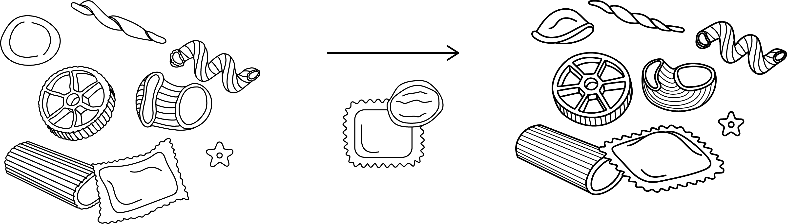

## About
"Pasta Chute" is a virtual common space built on [p5.js](https://p5js.org) that aims to connect people thanks to a topic of general interest: pasta.
The app is playable at: https://link<br>
"Past Chute" was developed as a part of the [Creative Coding](https://drawwithcode.github.io/) course at Politecnico di Milano.<br>
<br>Faculty: Michele Mauri, Tommaso Elli, Andrea Benedetti

## Table of Contents
1. [Project idea](#Project-idea)<br>
a. [Concept](#concept)<br>
b. [Context of use](#context-of-use)<br>
2. [Structure](#structure)<br>
a. [Homepage](#homepage)<br>
b. [Waiting room](#waiting-room)<br>
c. [Poll](#poll)<br>
d. [About](#about)<br>
e. [Ranking](#ranking)<br>
f. [Thank you page](#thank-you-page)<br>
3. [The Code](#the-code)<br>
a. [Tools](#tools)<br>
b. [Design challenges](#design-challenges)<br>
c. [Coding challenges](#coding-challenges)<br>
4. [Team](#team)<br>

## Project idea
#### Concept
As harmless as it might look, pasta often ends up at the center of animated debates, especially in our country.<br>
Our team wanted to trigger the same heartfelt involvement in this kind of debate, by asking users to root for their favorite type of pasta.<br>
The purpose is light and humorous: to entertain people through a very simple, yet engaging experience and to make them feel part of something big, despite (or maybe even thanks to) the trivial subject.
The creative process is very similar to the one of memes, as it starts from picking a very simple piece of culture that has a surprisingly big impact because of its universality.


#### Context of use
The project is addressed to a broad target audience, but it's expected to spark interest and hopefully mostly among young people.<br>
The game is always ongoing and there are no special events, so that people can jump in, fool around and browse the app whenever they want. This is why it was very important for us to make the game suitable for both computers and mobile devices.<br>
Friends can arrange to visit the website at the same time to play together or against each other, but one can also play alone, fooling around, asking themselves what pasta they prefer, discovering new types and formats, learning new information about pasta, and browsing the game records.


## Structure
#### Homepage
The homepage is designed to welcome the user and to prepare them to the fast dynamics of the poll. The library [skrollr](https://github.com/Prinzhorn/skrollr) was used to display a sequence of very concise information about the attitude they need to take on: be fierce, be fast and ready to click.<br>
Once they are ready to enter the game, the user clicks on a button and a pop-up appears that counts down the time remaining to the end of the current match (max. 15 seconds).<br>
The purpose of this section is to entertain the user until the start of a new match, so that they don't find themselves in the middle of a duel that has already started. It contains a mini-game: pieces of pasta falling from above and a colander that can be moved to catch as many pieces as possible.


#### Waiting room
The waiting room is a 5-second-long transitional phase between a match and another.<br>
A truly Italian-stereotype-style red checkered tablecloth flutters on the screen and falls at the end of the timer, uncovering the actual poll. During this phase, online users can see each other's cursors, in the form of forks, and therefore understand how many players are online with them at that moment.<br>
If one is tired to play, there is a button that leads to the [thank you page](#thank-you-page).<br>
The tablecloth is a 3D object built in [three.js](https://threejs.org/), which was taken from [Memetic Warfare Archive](https://densitydesign.github.io/teaching-dd15/course-results/es03/group03/).

#### Poll
The poll works in a very simple way. The screen is split in two halves; each side houses each round a different type of pasta. The user needs to place their mouse (or their finger) on the side they want to vote for, and click (or tap) as many times as possible to make it win. Each click generates a piece of the chosen pasta in that position of the screen, this then falls on the ground and piling up on the others, thanks to the mechanics of [matter.js](https://brm.io/matter-js/). This visual representation makes it very easy to understand what pasta is winning and the contribution of the other users, who are generating pasta on the other side of the screen.<br>
Each match last 15 seconds. The short duration makes the single contest very quick and ephemeral, but all results contribute to the overall ranking.

#### About
The section "About" is a hidden overlay that slides over the screen from the left, when triggered by clicking (or tapping on) the corresponding button in the header.<br>
It contains information about the project and the elective course. A click on the symbol of the typical Italian hand gesture "mano a borsa" displays the names of the team members and of the professors.


#### Ranking
The section "Ranking" is a hidden overlay that slides over the screen from the right, when triggered by clicking (or tapping on) the corresponding button in the header.<br>
It contains the global results of the game. It ranks all the types of pasta by the total amount of clicks received.

#### Thank you page
This page is reachable through the waiting room, the user can visit it when they are tired of playing and want to leave the website. It contains each time a different piece of trivia about pasta, which is randomly selected from an array.

## The Code
The app was built mostly in [p5.js](https://p5js.org/). The library [matter.js](https://brm.io/matter-js/) was used to render the mechanics of the pieces of pasta falling from above.

#### Tools
* [p5.js](https://p5js.org/)
* [matter.js](https://brm.io/matter-js/)
* [JQuery](https://jquery.com/)
* [skrollr.js](https://github.com/Prinzhorn/skrollr)
* [three.js](https://threejs.org/)

#### Design challenges
One of the design challenges was creating a web app that was true to our vision of a simple, brutalist website with a cool graphic setup and a conscious and punctual use of colour.<br>
The core idea was to create a cool engaging web experience regardless of the simplicity of the chosen topic.<br>
From the get-go we had a clear idea of how the app should look like from the typographical point of view: the juxtaposition of a bold grotesk font and an italic serif. The idea was to pair the textual elements with illustrations of the various formats of pasta, drawn in a "wireframe" style.<br>
One of the challenges that came up during the illustration process was making sure they looked in line with the rest of the website, not being too organically realistic - which would clash with the overall look - or geometrically rigid, which would make the pieces look stiff when falling and piling up.<br>
<br>

<br>
<br>
From the perspective of HTML and CSS design it wasn't easy to fit all of the information in as few HTML documents as possible.<br>
It also wasn't easy to make the website responsive for viewing and interacting on mobile, considering the different interaction methods between the two types of devices and the change in proportions and screen ratios.

#### Coding challenges
<br>
Coding wise one of the challenges was linked to the usage of the timer function and all the other functions linked to it. A variable neexed to be passed from a webpage to another, and certain functions needed to be called when the timer reached a certain amount.<br>

Another coding issues we ran into was linked to the pixel density of mobile screens. When the game was displayed vertically on a smartphone, p5 interpreted the canvas as made up by a larger amount of pixels, and therefore the pieces of pasta looked like they were falling in slow-motion. We solved this issue by creating an if statement that handled the physics of the pieces of pasta according to the proportions and the ration of the screen

We used Mapbox for the main part of the WebApp. To intergrate Mapbox GL inside p5.js we used a library called [mappa.js](https://mappa.js.org), a tool that facilitates work between the canvas elements and the existing map libraries and APIs.
We slightly changed mappa.js to add a gps button that helps the user to go back to his position:
```javascript
map.addControl(
  new mapboxgl.GeolocateControl({
	  positionOptions: {
		  enableHighAccuracy: true
		},
		trackUserLocation: true,
		showUserLocation: false
	})
);
```
The main challenge was based around having such a large number of interactions that need to be registered, remembered and broadcasted to everyone.
We overcame this challenge by relying on a local JSON file that is updated each time a change to the present version happens, by sending signals from the client to the server and then back to all the other clients with [socket.io](https://socket.io), an engine that enables real-time, bidirectional and event-based communication.
As an example, when someone sends a present, a JSON variable will be automatically sent to the server holding all the present information:
```javascript
//Variable holding the new present information
var data = {
  x: rx,
  y: ry,
  q1: question1,
  show: iconshow
}

//JSON variable holding the previous variable
var json = {
  method: 'POST',
  headers: {
    'Content-Type': 'application/json'
  },
  body: data
}

//Emit the Present data to other Users
socket.emit('present', json);
```
When the server receives the signal and the gift information it starts a function to change the local JSON by adding this new information:
```javascript
function jsonUpdate(request){
  var testo = request.body; //assign the information of the present that a user sent to the variable testo
  var fs = require('fs'); //Call FileSystem API to read and modify JSON file

	//Read JSON file
	fs.readFile('./public/presents.json', 'utf8', function readFileCallback(err, data) {
    if (err) {
      console.log(err); //If the read produces an error, log it on the console
    } else {
      obj = JSON.parse(data); //Convert the JSON into an object
      obj.regali.push(testo) //Put the present information as a new entry inside the objects
      json = JSON.stringify(obj, null, 2); //Convert the object into a string
      fs.writeFile('./public/presents.json', json, finished); //Write new entry into JSON
		  socket.broadcast.emit('presentBroadcast', request); //Send the update to all clients
    }
  });
}
```
And then a signal is emitted to all the clients to update the presents:
```javascript
regalimported = []; //deletes all the previous shown presents
database = loadJSON("../presents.json"); //Loads JSON with new information
//Recreate all the gifts Objects on the map after some time to ensure that the JSON is loaded
setTimeout(function() {
  for (var t = 0; t < database.regali.length; t++) {
    var data = {
      x: database.regali[t].x,
      y: database.regali[t].y,
      q1: database.regali[t].q1,
      show: database.regali[t].show,
      index: t
    }
    regalimported[t] = new RegaloImported(data);
  }
}, 1000);
```
In general we used mostly p5.js to handle events but for graphics and animations we used JQuery and CSS as it's easier to use these to make more fluid and dynamic animations.


## Team
* [Martina Bracchi](mailto:martinabracchi.mb@gmail.com)  
* [Silvia Casavola](mailto:silcasavola@gmail.com)
* [Dario Faudella](mailto:dario.faudella@gmail.com)  
* [Manuel Reale](mailto:manuel.reale2000@gmail.com)
* [Donato Renzulli](mailto:donren.99@gmail.com)
